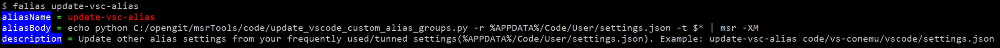

# Tools for Automation

- [msr + nin](https://github.com/qualiu/msr) for file processing + data mining.
- [vscode-msr](https://marketplace.visualstudio.com/items?itemName=qualiu.vscode-msr) for code mining + change code + alias for all terminals/IDEs.
  - For clickable terminal in **Visual Studio** (like 2022), see [ConEmu + VisualStudio integration](./code/vs-conemu/README.md).
- Alias Tools
  - Besides tools above, introduce alias tools to help simplify frequently used operations like git operations (like [gpm](https://github.com/qualiu/msrTools/blob/master/custom-alias/settings.json#L68-L72) / [gdm-l](https://github.com/qualiu/msrTools/blob/master/custom-alias/settings.json#L113-L117) / etc.)

## Why Use Custom Alias or Normal Alias

- Save lifetime for frequently used tools and command lines - call the short alias/doskeys names.
- Write alias **once and for all** - for **current + future** vscode on Windows + Linux + MacOS plus Docker Containers in them.
  - Optional: [Turn on auto-sync settings for vscode](https://code.visualstudio.com/docs/getstarted/settings#_settings-sync) is a great extra convenience to auto sync settings across machines.
  
### When Should Use vscode to Update Alias

**Needless** to always use/open vscode (with [vscode-msr](https://marketplace.visualstudio.com/items?itemName=qualiu.vscode-msr)) - unless you changed/added new alias/doskeys.

- For [normal aliases](https://marketplace.visualstudio.com/items?itemName=qualiu.vscode-msr#make-command-shortcuts-to-search-or-replace-in-or-out-of-vscode):
  - Type **update-alias** to reload changes for old/existing terminals out-of vscode.
- For [custom aliases](https://marketplace.visualstudio.com/items?itemName=qualiu.vscode-msr#custom-alias-to-auto-sync-across-local-and-remote-ssh-hosts-plus-docker-containers) (see [**difference**](https://github.com/qualiu/vscode-msr/blob/HEAD/Create-Custom-Common-Alias-Once-and-for-All.md#difference-between-custom-alias-and-normal-alias) to normal alias):
  - Open vscode to auto update aliases, then type **update-alias** to reload changes for old/existing terminals out-of vscode.
- If your changes involve **nested** calling to other alias/doskeys:
  - Open vscode and [**take 1 click to dump aliases**](https://marketplace.visualstudio.com/items?itemName=qualiu.vscode-msr#make-command-shortcuts-to-search-or-replace-in-or-out-of-vscode) to script files, then type **update-alias** to reload changes for old/existing terminals out-of vscode.

## Create + Find + Update + Merge + Remove Alias

- Create alias:
  - See [**Create Custom Alias**](https://github.com/qualiu/vscode-msr/blob/HEAD/Create-Custom-Common-Alias-Once-and-for-All.md) and use **to-alias-body** to help transform multi-line alias body to one-line JSON.
- Find alias/doskeys details (command line):
  - Use [**falias**](https://github.com/qualiu/msrTools/blob/master/custom-alias/settings.json#L335-L339) to find custom alias like **falias** [update-vsc-alias](https://github.com/qualiu/msrTools/blob/master/custom-alias/settings.json#L330-L334) , this will output 3 lines: `aliasName` + `aliasBody` + `description`.
  
    - Use **grep-vsc** like **grep-vsc** -t `falias` to find location in vscode settings.json to view or update.
  - Use [**alias**/**malias**](https://github.com/qualiu/vscode-msr/blob/master/src/commonAlias.ts#L86) to find normal alias like **alias** `gpc` or **malias** `gph` or **malias** `gca` or **malias** `gca=` and etc.
    - Of-course, you can also find custom alias like **alias** [gdm-ml](https://github.com/qualiu/msrTools/blob/master/custom-alias/settings.json#L133-L137) without description info.
- Update alias groups from another settings.json file:
  - Use [**update-vsc-alias**](https://github.com/qualiu/msrTools/blob/master/custom-alias/settings.json#L330-L334) to update or merge 3 alias groups.
- Remove alias:
  - Use [**rm-alias**](https://github.com/qualiu/msrTools/blob/master/custom-alias/settings.json#L365-L369) to remove alias + its script file (if dumped) like: **rm-alias** `{alias-name}`.

## Difference between Custom Alias and Normal Alias

- **Normal alias**: Easy to write - See [**Cook Normal Alias**](https://marketplace.visualstudio.com/items?itemName=qualiu.vscode-msr#make-command-shortcuts-to-search-or-replace-in-or-out-of-vscode) for more guide/details.

- **Custom alias**: Easy to sync - See [**Create Custom Alias**](https://marketplace.visualstudio.com/items?itemName=qualiu.vscode-msr#custom-alias-to-auto-sync-across-local-and-remote-ssh-hosts-plus-docker-containers) for more guide/details especially use [**to-alias-body**](https://github.com/qualiu/vscode-msr/blob/HEAD/Create-Custom-Common-Alias-Once-and-for-All.md#use-to-alias-body-to-transform-multi-line-alias-body-to-one-line-json) to:
  - Help transforming multi-line alias body to one-line JSON.
  - Help escaping special characters (including Windows path slashes) in alias body.

## Notes for Writing Alias Body with PowerShell for Windows

When you writing aliasBody like `PowerShell -Command "{command lines body}"` (or `pwsh -Command "xxx"`), follow these rules to avoid unexpected errors:

- Do not name a variable starting with **`"b g l t"`** (like `$tableName` / `$list` / etc.) in the `{command lines body}` to avoid [doskeys conflict](https://learn.microsoft.com/en-us/windows-server/administration/windows-commands/doskey).
- Be care of **$1** / **$2** conflicts with Regex replacement (capture group) in the `{command lines body}`.
  - Use [**msr**](https://marketplace.visualstudio.com/items?itemName=qualiu.vscode-msr#additional-tips) -t `"matched (group)"` -o "matched **\1**" ... to fix conflict of **$1** with **\1**.
- Try to use single quotes `'` instead of double quotes `"` in the `{command lines body}`.

Follow examples in [custom-alias/settings.json](./custom-alias/settings.json) to write `aliasBody` with PowerShell, and don't forget to use **to-alias-body** to help transform command lines.

## Appendix

### Install Common Tools if Needed

- You can manually install [**jq**](https://stedolan.github.io/jq/download/) or by command line: `winget install jq`([built-in winget](https://learn.microsoft.com/en-us/windows/package-manager/winget/)), or `choco install jq`(if you have [Chocolatey](https://community.chocolatey.org/packages/ConEmu)).

### Hot Reload Environment Variables for New Alias or Tools on Windows

- Type [reload-env](https://marketplace.visualstudio.com/items?itemName=qualiu.vscode-msr#additional-tips) for any new tools (like jq) if you failed to found.
- Type [add-user-path](https://marketplace.visualstudio.com/items?itemName=qualiu.vscode-msr#additional-tips) `{new-tool-folder}` if you still cannot find the new tool.
