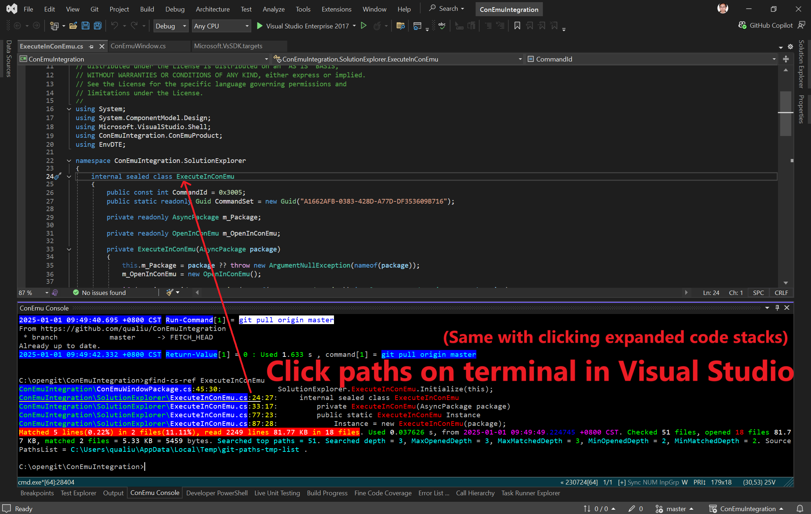

# Integrated Coding Tool + Debugging in Visual Studio (+VsCode)

Use [ConEmu terminal](https://conemu.github.io/) and [ConEmu VS extension](https://marketplace.visualstudio.com/items?itemName=DavidRoller.ConEmuIntegration2022) for `Visual Studio (like VS 2022)`.

- [Vscode](https://code.visualstudio.com/download) and [vscode-msr extension](https://marketplace.visualstudio.com/items?itemName=qualiu.vscode-msr) are **optional** (can be integrated with VS + system console/terminal).
  - See [**Why + How** to Use Custom Alias and Normal Alias](../../README.md) for more details.

## 1. Setup ConEmu Terminal with Visual Studio

### Install ConEmu Terminal + ConEmu VS Extension

- Manually install [ConEmu](https://conemu.github.io/) or run command: `winget install conemu`([built-in winget](https://learn.microsoft.com/en-us/windows/package-manager/winget/)), or `choco install conemu`(if you have [Chocolatey](https://community.chocolatey.org/packages/ConEmu)).

- Install [ConEmu VS extension](https://marketplace.visualstudio.com/items?itemName=DavidRoller.ConEmuIntegration2022) in Visual Studio (need to restart VS).

### Setup ConEmu with Visual Studio

- Clone this repository.
- Setup ConEmu by running long command below in a CMD window (replace **`C:\opengit\msrTools`** to your local path at first):
  - **ConEmuC -GuiMacro SetOption FarGotoEditorPath** `"PowerShell -NoProfile -ExecutionPolicy Bypass -NoLogo -WindowStyle Hidden -File` **`C:\opengit\msrTools\`**[code\vs-conemu\Open-ClickedPathRow-in-VisualStudio.ps1](./Open-ClickedPathRow-in-VisualStudio.ps1) `\"%1\" \"%2\" \"%3\""`
    - If failed due to not found `ConEmuC`: Run [add-user-path](https://marketplace.visualstudio.com/items?itemName=qualiu.vscode-msr#additional-tips) `"C:\Program Files\ConEmu\ConEmu"` then re-run above command.
- Follow [this **screenshot**](./images/init-setup-conemu-in-vs.png) to setup ConEmu with Visual Studio.
  - You can also run command alias [setup-vs-conemu](https://github.com/qualiu/msrTools/blob/master/code/vs-conemu/vscode/settings.json#L3-L7) if you done alias step below.
- Optional: Use [**normal + custom alias**](https://marketplace.visualstudio.com/items?itemName=qualiu.vscode-msr#custom-alias-to-auto-sync-across-local-and-remote-ssh-hosts-plus-docker-containers) (like [**gfind-cs-pref**](https://github.com/qualiu/msrTools/blob/master/code/vs-conemu/vscode/settings.json#L8-L12)) to help **general** code mining + file processing in System + Vscode + Visual Studio.

## 2. Use ConEmu Terminal in Visual Studio

### Advanced code mining in Visual Studio with Clickable Code Paths

- Example: Search all references in whole repository (not just solution scope of current *.sln) + filter output all junk results (tests + definitions):
  - [**gfind-cs-pref**](https://github.com/qualiu/msrTools/blob/master/code/vs-conemu/vscode/settings.json#L8-L12) `ExecuteInConEmu`
    - You can [add more args](https://marketplace.visualstudio.com/items?itemName=qualiu.vscode-msr#search-files-with-rich-filters) like below - the **more** args, the **faster** searching speed:
      - gfind-cs-pref `ExecuteInConEmu` **--xp** `Tool,test,/unit`
      - gfind-cs-pref `ExecuteInConEmu` **--sp** `/ConEmu,Integration`

