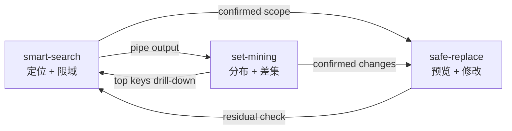

# Skills Overview

本目录沉淀面向 AI Agent 的可复用操作能力。

## 目的

本目录沉淀的是面向 AI Agent 的操作指南，围绕两个跨平台工具和一个 alias/runtime layer 组织：

- **msr**（`match-search-replace`）：支持搜索、提取、in-place 替换、路径过滤、block 修改、统计与批量执行（`-X`）
- **nin**（`n-in-n`）：支持 diff、intersection、distribution、Pareto、regex-key 提取和结构保留过滤；无需预排序
- **vscode-msr**：提供 alias 发现、`gfind-*` / `find-*` / `rgfind-*` 选择，以及 repo 内的默认搜索入口

配合 VS Code 插件 [vscode-msr](https://marketplace.visualstudio.com/items?itemName=qualiu.vscode-msr) 生成的 alias 体系，可以获得 git-scoped 搜索、缓存文件列表和运行时 alias discovery。

**适用规模**：从小型项目到大型 monorepo。对大仓库来说，路径限定搜索实测可比 ripgrep 快 `8~22×`，因为它会在遍历阶段直接跳过无关文件。

这套 skill 以 **msr** 和 **nin** 为核心，面向通用文本搜索、提取、过滤、替换、统计与集合分析任务。`gfind-*` 在代码仓库场景下提供更高效的 repo-scoped 搜索入口。它们的主要价值是让 Agent 用更少的 tool call、更低的 token 和更高的结果可信度完成决策。

## 主要读者

- **第一读者**：需要快速决定第一步动作、fallback 路径和 guardrail 的 AI Agent
- **第二读者**：维护这些 skill 的作者

## 最小前置条件

1. 安装 vscode-msr 扩展（会自动安装 msr 和 nin 依赖工具）：
   ```
   code --install-extension qualiu.vscode-msr
   ```
2. 用 VS Code 打开目标仓库（会自动生成该 repo 优化后的 `gfind-*` / `find-*` alias）：
   ```
   code <repo-folder>
   ```

## 快速选读

只读与下一步动作最相关的 skill：

- **要先定位、限域或降噪** → [`smart-search`](./smart-search/SKILL.md)
- **已经找到候选文件，准备安全地做文本修改** → [`safe-replace`](./safe-replace/SKILL.md)
- **要做 diff、intersection、Pareto、top-N 或结构保留过滤** → [`set-mining`](./set-mining/SKILL.md)

默认不要：

- 在 [`smart-search`](./smart-search/SKILL.md) 还没定义最小可行范围前，就先用 IDE `search_files`
- 在 [`safe-replace`](./safe-replace/SKILL.md) 还没定义 preview 和 residual check 前，就直接做高风险批量替换
- 在 [`set-mining`](./set-mining/SKILL.md) 还没介入前，就把计数或热点问题退化成手工翻日志

## 边界与默认约束

这些 skill 的重点是 **默认动作顺序、fallback 路径和 guardrail**，不是完整手册。

默认边界：

- 聚焦 `msr` / `nin` 及其 alias（`gfind-*` / `find-*`）驱动的文本工作流
- [`SKILL.md`](./smart-search/SKILL.md) 讲默认动作顺序；[`references.md`](./smart-search/references.md) 放参数细节与边界情况
- 若项目有更强的仓库规则、shell 约束或 PR 规范，以项目规则优先；这些 skill 只补通用决策模板

## Workflow

三个 skill 形成 **搜索 → 分析 → 修改** 的闭环：



典型流程示例：
1. `gfind-file -I -f "\.cs$" -t "\bOldSymbol\b" -l -H 20` — 定位受影响文件
2. `gfind-file -I -f "\.cs$" -t "\bOldSymbol\b" -C -H 30 | nin nul "^([^:]+):" -pd -H 10` — 分析文件分布
3. `gfind-file -I -f "\.cs$" -t "\bOldSymbol\b" -o "NewSymbol" -j -H 20` — 预览变更
4. `gfind-file -I -f "\.cs$" -t "\bOldSymbol\b" -o "NewSymbol" -RK` — 应用 + 备份
5. `gfind-file -I -f "\.cs$" -t "\bOldSymbol\b" -H 1 -J` — 验证残留为零

## 文档分层

每个 skill 保持两层可见结构：

- `SKILL.md`：默认动作顺序、第一选择、以及高频 guardrail
- `references.md`：参数细节、shell-specific 写法、模板和边界情况

### 1. [`smart-search`](./smart-search/SKILL.md)

适合在下一步需要以下能力时阅读：

- 选择最小可行搜索范围
- 在展开全文前先限制输出规模
- 组合路径过滤与内容过滤，而不是过早扩 scope
- 在高噪音或大仓库场景下安全定位

### 2. [`safe-replace`](./safe-replace/SKILL.md)

适合在下一步需要以下能力时阅读：

- 写入前先验证 scope
- 应用前先预览文本变换
- 处理 block-scoped 修改、编码风险、residual validation
- 把搜索结果转成可控的多文件文本修改

### 3. [`set-mining`](./set-mining/SKILL.md)

适合在下一步需要以下能力时阅读：

- 比较两个集合或两份输出
- 总结分布、热点、Pareto 覆盖率
- 在过滤时保留结构
- 把搜索输出转成分组或排序后的结论

